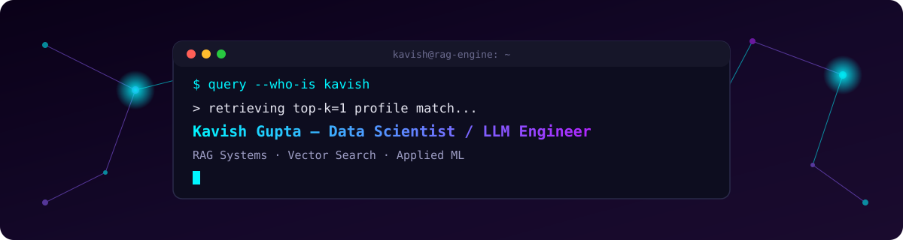

<div align="center">

</div>

<div align="center">


[](https://linkedin.com/in/kavish-gupta-3a072435a)
[](https://leetcode.com/KavishSam_10)
[](mailto:kavishgupta21177@gmail.com)

</div>

<br/>

> This README isn't just a bio — it's structured like the RAG pipelines I build. Every section is a stage: **retrieve → augment → generate.** Query me below. 👇

<br/>

## 🔎 `RETRIEVAL` — pulling context on who I am

```python
>>> retriever.get_relevant_context(query="who is kavish gupta?", top_k=3)

[
  Document(
    source="Thapar Institute of Engineering and Technology",
    content="B.E. Computer Science and Engineering · GPA 9.7/10 · Aug 2023 – Present",
    score=0.98
  ),
  Document(
    source="specialization",
    content="Data Scientist & LLM Engineer — RAG pipelines, LLM evaluation, vector search",
    score=0.96
  ),
  Document(
    source="track_record",
    content="700+ LeetCode problems · Amazon ML Summer School 2025 · Flipkart GRID 6.0 Semifinalist",
    score=0.93
  )
]
```

I design and ship AI systems end-to-end — hybrid retrieval pipelines, LLM-evaluated RAG assistants, and behavioral ML models that catch problems before they surface. I care less about a model looking clever in a notebook, and more about whether it's **evaluable, explainable, and actually deployed.**

<br/>

## 🧩 `CONTEXT WINDOW` — what's loaded into memory

<table>
<tr><td valign="top" width="50%">

**Core Stack**
```
languages    │ Python · C++ · SQL
llm_stack    │ LangChain · HuggingFace · ChromaDB
eval         │ RAGAS (faithfulness, relevancy, precision)
serving      │ FastAPI · Streamlit · Plotly Dash
dl           │ PyTorch (LSTM Autoencoders)
```

</td><td valign="top" width="50%">

**Supporting Stack**
```
data         │ MongoDB · pandas-style EDA
viz          │ Tableau · Matplotlib · Seaborn
web          │ HTML · CSS · Tailwind
graph        │ NetworkX
tools        │ Git · GitHub · Jupyter · VS Code
```

</td></tr>
</table>

**Retrieval confidence by domain** *(how deep I can go if you ask)*

```
RAG & Hybrid Retrieval     ████████████████░░░░  82%
LLM Evaluation (RAGAS)     ██████████████░░░░░░  74%
LangChain Orchestration    ████████████████░░░░  80%
Deep Learning (PyTorch)    █████████████░░░░░░░  68%
Classical ML / EDA         ██████████████░░░░░░  75%
Data Structures & Algo     █████████████████░░░  85%
```

<br/>

## ⚙️ `AUGMENTATION` — projects that shaped the model

<table>
<tr>
<td width="33%" valign="top">

**🔍 Codebase Q&A**
<br/><sub>RAG-based AI</sub>

Natural-language queries over GitHub repos, with **file- and line-level citations**.

- AST-aware chunking
- Hybrid semantic + BM25 retrieval
- RAGAS-evaluated, multi-turn memory

`LangChain` `ChromaDB` `FastAPI`

[**→ open repo**](https://github.com/Kavish1504/CodeBase-Q-A)

</td>
<td width="33%" valign="top">

**📊 CareerLens**
<br/><sub>AI Career Intelligence</sub>

Extracts career signals from resumes, detects **plateaus**, benchmarks pay.

- spaCy NER + regex parsing
- Live job-market skill scoring (Adzuna)
- Groq LLaMA 3.3 70B narrative + 90-day plan

`LangChain` `Groq` `Plotly Dash`

[**→ open repo**](https://github.com/Kavish1504/CareerLens)

</td>
<td width="33%" valign="top">

**🕵️ Silent Attrition Detector**
<br/><sub>Disengagement Detection</sub>

Flags employee disengagement **4–6 weeks early**, before resignation.

- 5 PyTorch LSTM Autoencoders
- NetworkX collaboration-drift analysis
- Manager-facing severity dashboard

`PyTorch` `NetworkX` `Plotly Dash`

[**→ open repo**](https://github.com/Kavish1504/Silent-Attrition-Detector)

</td>
</tr>
</table>

<br/>

## 🧬 `PIPELINE HISTORY` — experience log

```diff
+ [2025 – Present]  Training & Placement Representative · Thapar Institute
    communicated drive schedules & eligibility to 100+ students
    coordinated pre-placement talks and on-campus recruitment logistics

+ [2022 – 2023]     Head of Media and Magazine · Budha Dal Public School
    led a 15+ member student media team across major school events
    owned the editorial pipeline for the annual school magazine, end to end
```

<br/>

## ✨ `GENERATION` — output & recognition

<div align="center">

| 🏅 | Signal |
|:--:|:-------|
| 🧩 | **700+** problems solved on LeetCode (DSA) |
| 🤖 | Selected — **Amazon ML Summer School 2025** |
| 🏆 | Semifinalist — **Flipkart GRID 6.0** |
| 📜 | Generative AI — **IBM (Coursera)** |
| 🎓 | **9.7 GPA** · B.E. CSE, Thapar Institute |

</div>

<br/>

## 📡 `SYSTEM DIAGNOSTICS` — live from GitHub

<div align="center">


</div>

<div align="center">

</div>

<br/>

## 📮 `ENDPOINT` — reach me

```bash
curl -X POST https://kavish.dev/connect \
  -H "Content-Type: application/json" \
  -d '{
        "email": "kavishgupta21177@gmail.com",
        "linkedin": "linkedin.com/in/kavish-gupta-3a072435a",
        "github": "github.com/Kavish1504",
        "leetcode": "leetcode.com/KavishSam_10"
      }'

# 200 OK — response usually within a day
```

<div align="center">
<sub>every dataset tells a story — I build the systems that read between the lines.</sub>
</div>
